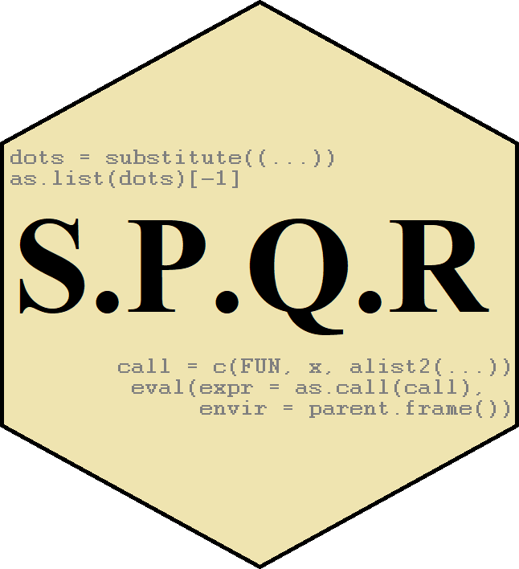

---
output:
  github_document:
    html_preview: true
---

<!-- README.md is generated from README.Rmd. Please edit that file -->

```{r, echo = FALSE}
knitr::opts_chunk$set(
  collapse = TRUE,
  comment = "#>",
  fig.path = "man/figures/README-"
)
```

# SPQR 

Govern your calls in `R` with SPQR.
```{r setup, include=FALSE}
knitr::opts_chunk$set(echo = TRUE)
knitr::opts_chunk$set(out.width='750px', dpi=200)
```

## Overview

This package is about manipulating calls in handy ways. It contains four 
main functions, `S`, `P`, `Q`, and `R`.

* `S`: Substitutes the enclosing environment of the function in a call for the
current environment. 
* `P`: Creates an anonymous function from a partial function call.
* `Q`: Changes the default arguments of a function. 
* `R`: Allows a function arguments to be defined recursively.

These functions are intended to be useful in experimental `R`-work, such as 
simulations, trying out new algorithms, messing around with different models,
et cetera. 

## Installation
From inside `R`, use one of the following commands:
```{r install, echo = TRUE, eval = FALSE}
# For the development version from GitHub:
# install.packages("devtools")
devtools::install_github("JonasMoss/SPQR")
```
## Usage

### The `R` function
The `R` function can be used for simulations in this way.

```{r R-data-frame-good, echo = TRUE}
library("SPQR")
n = 100
sim = R(data.frame(y = 5 + 3*x1 + 6*x2 + rnorm(n),
                  x1 = rnorm(n),
                  x2 = rnorm(n)))
lm(y ~ x1 + x2, data = sim)
```

Without the `R` function, we typically have to do something like
```{r R-data-frame-bad, echo = TRUE}
n = 100
y = 5 + 3*x1 + 6*x2 + rnorm(n)
x1 = rnorm(n)
x2 = rnorm(n)
df = data.frame(y = y, x1 = x1, x2 = x2)
lm(y ~ x1 + x2, data = df)
```
But this messes up your namespace, as it makes three new useless variables `y`, 
`x1`, and `x2`, variables you don't really need. In addition, if any of these 
variables are already present in your namespace, they are overwritten. This is a
hassle, and can create hard-to-understand bugs.

Another handy example is printing. When doing exploratory data analysis, I find
myself in need of ploting things again and again. With `R`, I can do the 
following:

```{r plotting, echo = TRUE}
R(plot(x = seq(-1, 1, by = 0.01), dnorm(x, 0, 3)))
```